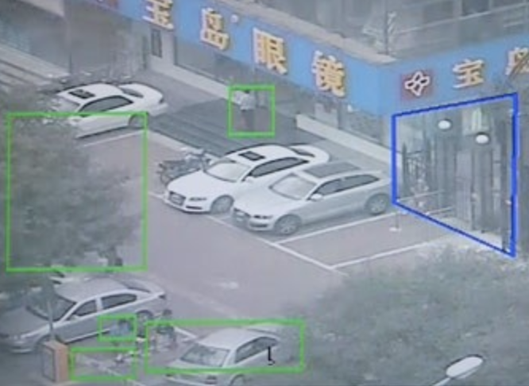
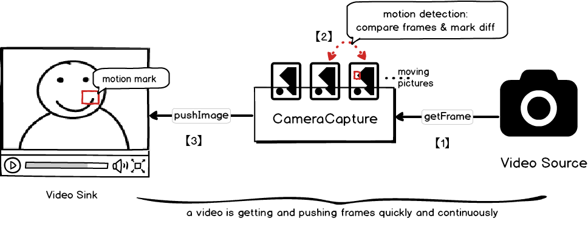
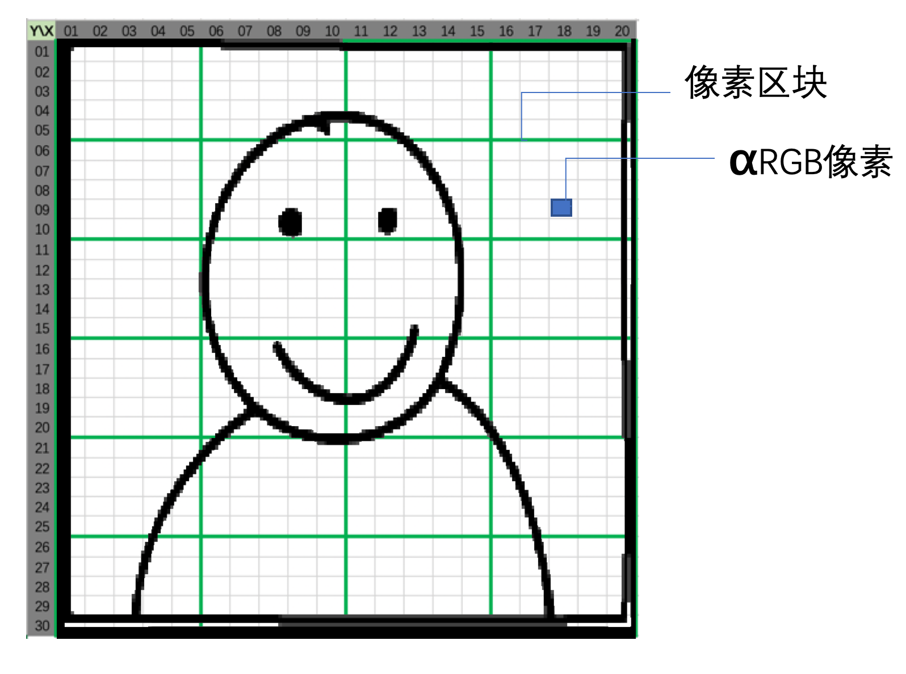
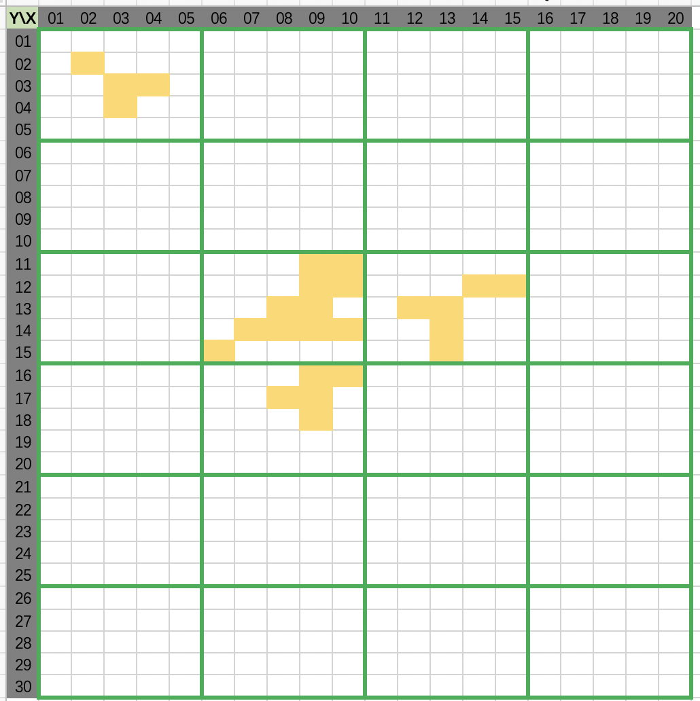
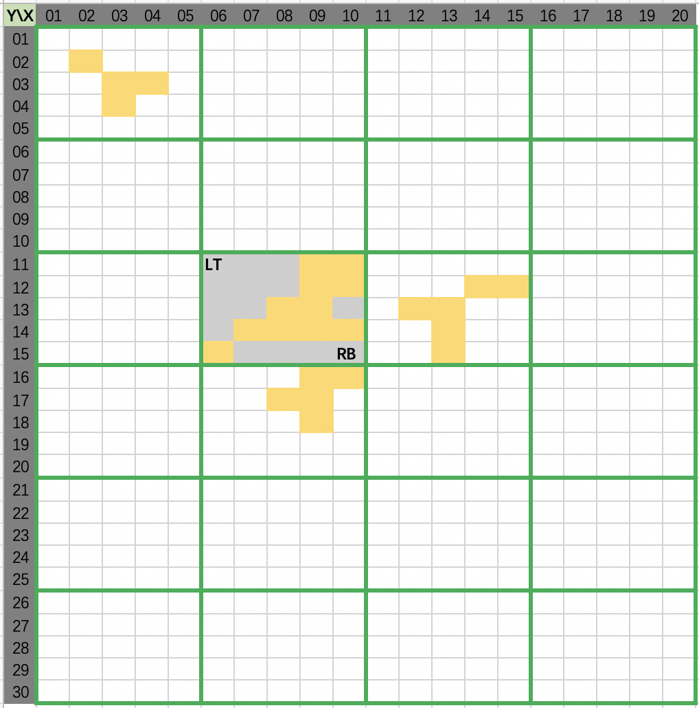
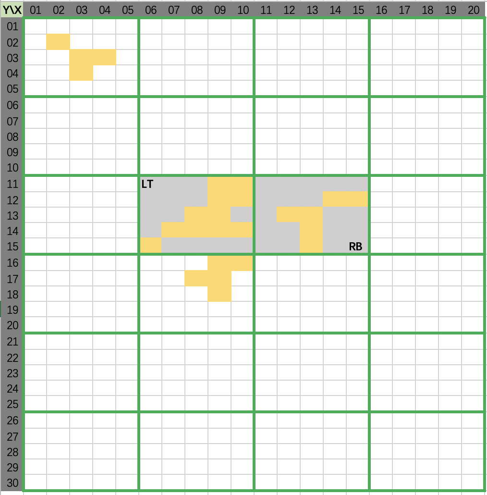
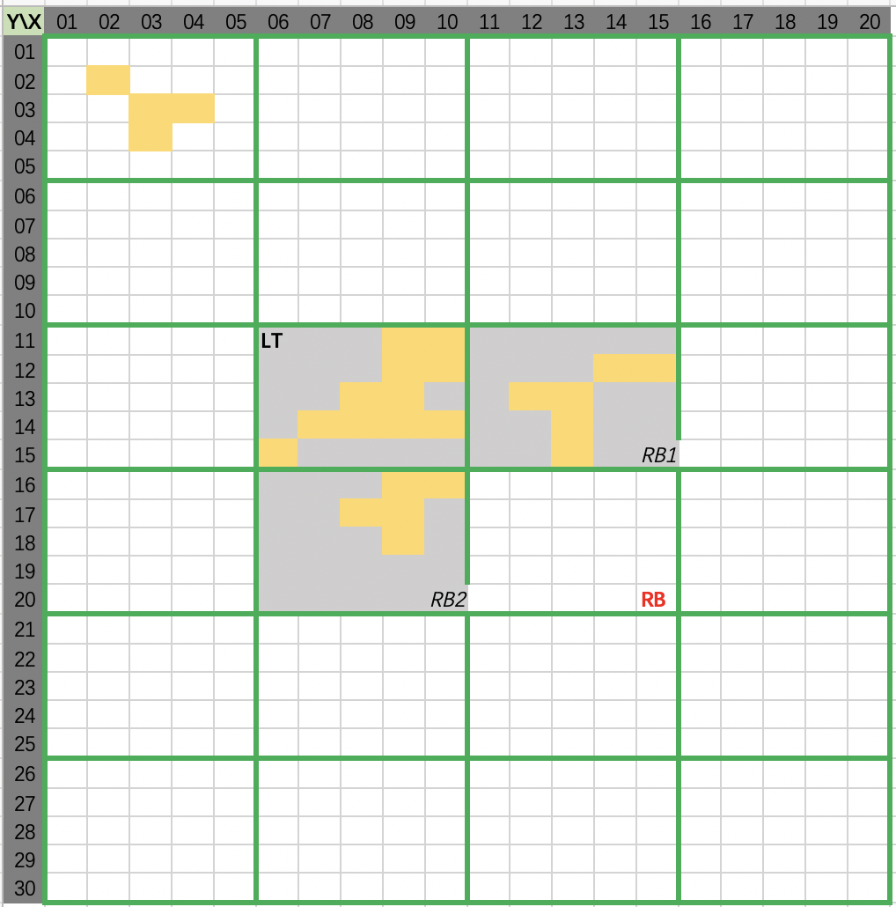
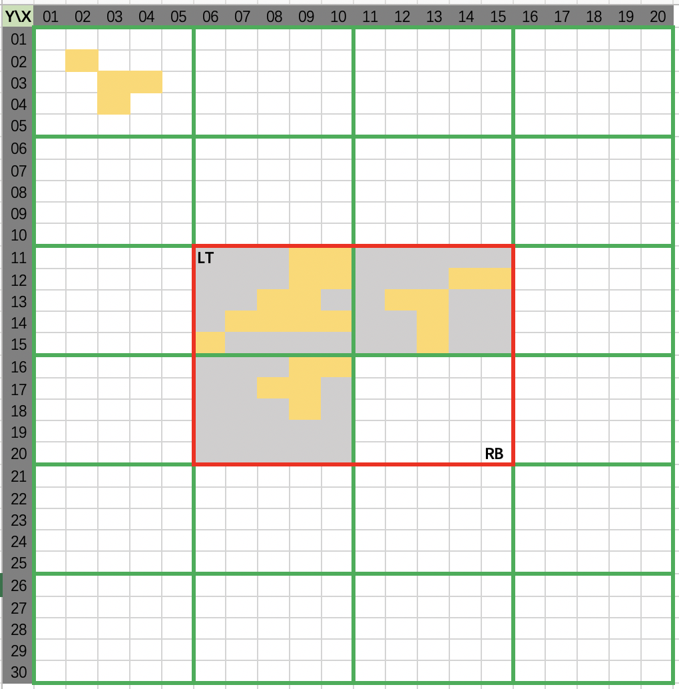

# 视频运动检测

<!-- MDTOC maxdepth:6 firsth1:1 numbering:0 flatten:0 bullets:1 updateOnSave:1 -->

- [视频运动检测](#视频运动检测)   
   - [程序设计原理](#程序设计原理)   
   - [运动检测算法](#运动检测算法)   
      - [像素划分区块](#像素划分区块)   
      - [区块运动像素](#区块运动像素)   
      - [判定运动区块](#判定运动区块)   
      - [合并邻居区块](#合并邻居区块)   
      - [标记合并区块](#标记合并区块)   

<!-- /MDTOC -->


这是一篇视频AI的科普教程。视频AI有什么用呢？

举个例子，比如用摄像头来看门，通常情况下无人打扰时，摄像头画面是相对静止的，如果突然出现运动的人或物，就会在画面中标记出来或者短信通知工作人员。如下图所示：




本文将用一个Java程序来展示这个功能，并详述其原理，让每个小伙伴们都能入门视频AI。


## 下载并体验AI


``` bash

$ tar zxvf video-motion-detection-0.1.0.tar.gz
$ cd video-motion-detection-0.1.0
$ bin/video-motion-detection console

```


此时电脑的摄像头会被开启，对着摄像头摇摇头？AI会标记出运动区域。

>顺便说一下，``video-motion-detection-0.1.0.tar.gz``超过10M，Github不支持托管。请自行编译：

``` bash
$ git checkout 0.1.0
$ mvn clean package
$ file target/video-motion-detection-0.1.0.tar.gz
```


## 程序设计原理




整个程序分3个环节：

1. **抓帧**： 通过``JavaCV``（OpenCV的Java接口）连接电脑本地的摄像头，并快速&不断地抓帧（可以理解为拍照，这里的``帧``是图片的别名）。
2. **检测**： 前后两帧（也就是两幅图片）进行比较，找出它们中的不同，结合一定算法，判断这种不同是否属于运动，并对运动的区块用方框标记出来。
3. **推图**： 无论图片有没有运动区块，都往``ImagePanel``上贴图，要求快并持续，快到超过人类的视觉暂留，比如每秒贴图24张，人眼看到的就是视频了（``moving pictures``）。


顺便说一下，如果只是要从摄像头录制视频，上述第2步是一个可选项，运动检测可以理解为图片数据流的一个``过滤器``。


## 运动检测算法


上述流程中，第2环节的运动检测，介绍个朴素算法以便大家入门。这个算法简单讲就是比对前后两帧的每个像素，像素差值大于一定程度，就标记为``运动像素``。


### 像素划分区块



一个图片是由横纵的点阵构成的，每个点被称作为``像素``，每个像素通常是4个字节的整形数，每个字节被称作``通道``。其中第1个字节描述``alpha``通道，第2个是RGB三色体系的红色，第3是绿色，第4是蓝色。

上述示意图中，灰色小格子就是``像素``。为了后面的AI识别，我们按10x10划分区块``Block``（图中是5x5，绿色标线标注的）。


### 区块运动像素

接着就要计算前后两张图片（帧）的差异，MxN点阵中所有像素的``αRGB``的取值差，差值大于一定程度，就被认为是``运动像素``。并对每个区块，统计运动像素的个数。


代码``VideoMotionDetector#doBlockMotionCount.java``描述了这段逻辑：

``` java

/**
* 色差阈值：相邻的两帧，在同一像素点位置，如果色差大于阈值，则判定为运动像素。
*/
private int colorDiffThreshold = 30;

private void doBlockMotionCount(MatrixImage currImage, MatrixImage diffImage) {
        for (int y = 0; y < currImage.getHeight(); y++) {
            for (int x = 0; x < currImage.getWidth(); x++) {

                // 当前图在(x,y)点的RGB值
                int cR = currImage.rgbR(x, y);
                int cG = currImage.rgbG(x, y);
                int cB = currImage.rgbB(x, y);

                // 对比图在相同点的RGB值
                int dR = diffImage.rgbR(x, y);
                int dG = diffImage.rgbG(x, y);
                int dB = diffImage.rgbB(x, y);

                // 两个点在RGB的任一通道色差大于色差阈值，则判定为"运动像素"
                if (Math.abs(cR - dR) > colorDiffThreshold
                        || Math.abs(cG - dG) > colorDiffThreshold
                        || Math.abs(cB - dB) > colorDiffThreshold) {

                    // 区块内"运动像素"计数器累加1
                    int blockX = x / blockSizeThreshold;
                    int blockY = y / blockSizeThreshold;
                    blockMotionCount[blockX][blockY]++;
                }

            }
        }
    }
```


不妨假设运动像素的分布是下面的样子：



图中黄色（黄色充满运动感）荧光笔填涂的就是运动像素。


### 判定运动区块

统计完每个区块的``运动像素``的数量后，接下来就要判定这个区块是否是``运动区块``。判别的标准就是一个区块内超过半数是运动像素，它就是运动区块。


代码``VideoMotionDetector#isMotionBlock.java``描述了这段逻辑：

``` java


/**
* 区块粒度：将一张图片，切成很多个区块。每个区块大小为10像素*10像素。
*/
private int blockSizeThreshold = 10;


/**
* 判断一个区块是否是运动区块
*/
private boolean isMotionBlock(int blockX, int blockY) {
   int halfBlockPixels = (blockSizeThreshold * blockSizeThreshold) / 2;
   // 如果区块内有超过半数是运动像素，则区块判别为"运动区块"
   return blockMotionCount[blockX][blockY] > halfBlockPixels;
}

```





上述图例中，每个区块如果有大于5个的运动像素，就被定义为``运动区块``（左上角的那个区域虽然有运动像素，但是不够5个，判定为非运动区块）。


算法首先找到第一个``运动区块``，返回一个``Rect``，如图用``LT``标记的left-top左顶点，用``RB``标记的right-bottom右底点。


### 合并邻居区块


对于一个运动区块，合并周围5格近邻的运动区块。从左到右，从上而下，找到临近的运动区块，且尚未标记为运动的，把它纳入进来。


代码``VideoMotionDetector#mergeNeighborBlocks.java``描述了这段逻辑：

``` java

	/**
     * 合并周围5格近邻的运动区块
     */
    private void mergeNeighborBlocks(int blockX, int blockY, Rect pixelRect) {
        for (int nbx = blockX - 5; nbx < blockX + 5; nbx++) {
            for (int nby = blockY - 5; nby < blockY + 5; nby++) {

                // 邻居区块：某个指定区块周围5个区块
                boolean isNear5 = (nbx > 0 && nbx < pixelWidth / blockSizeThreshold)
                        && (nby > 0 && nby < pixelHeight / blockSizeThreshold);

                if (isNear5) {

                    // 对于邻居区块是运动的，且尚未被标记的
                    if (isMotionBlock(nbx, nby) && !blockMotionJudge[nbx][nby]) {

                        // 跟邻居对比，左顶点往左靠
                        if (nbx * blockSizeThreshold < pixelRect.getX1()) {
                            pixelRect.setX1(nbx * blockSizeThreshold);
                        }
                        if (nby * blockSizeThreshold < pixelRect.getY1()) {
                            pixelRect.setY1(nby * blockSizeThreshold);
                        }

                        // 跟邻居对比，右底点往右靠
                        if (nbx * blockSizeThreshold > pixelRect.getX2()) {
                            pixelRect.setX2(nbx * blockSizeThreshold);
                        }
                        if (nby * blockSizeThreshold > pixelRect.getY2()) {
                            pixelRect.setY2(nby * blockSizeThreshold);
                        }

                        // 把"邻居区块"也标记为"运动区块"
                        blockMotionJudge[nbx][nby] = true;

                        // 每当标记一个运动区域时，立即找出它的邻居区域也是运动的，但是尚未标记的
                        mergeNeighborBlocks(nbx, nby, pixelRect);
                    }
                }
            }
        }
    }

```


代码图示：两个运动区块，合并成一个大的区块，``LT``和``RB``分别标记合并后的区块坐标。




继续拓展，会把下面那个区块也合并进来，如下图：




### 标记合并区块


合并后，整个大区块都是运动区域，我们要在这个大区域上画个方框标记出来。代码``MontionMarker#startCamera2PanelContinuously.java``：


``` java

MatrixImage showFrame = currFrame;

if (lastFrame != null) {
	// motion detection
	List<Rect> motionRegions = motionDetecor.detect(currFrame, lastFrame);

	for (int i = 0; i < motionRegions.size(); i++) {
		Rect rect = motionRegions.get(i);

		MatrixImage markFrame = new MatrixImage(imageWidth, imageHeight);
		// deep copy and motion mark
		MatrixImage.copyRgbArray(currFrame, markFrame);

		// mark motion block with a tiffany blue rectangle
		// NICE-RED: 0xF01D39   NICE-BLUE: 0x0F76C1  TIFFANY-BLUE: 0x81d8cf
		markFrame.drawRect(rect.getX1(), rect.getY1(),
                           rect.getWidth(), rect.getHeight(), 2,
                           new Color(0x81d8cf));

		showFrame = markFrame;
	 } // end for
}

lastFrame = currFrame;

// push original current image or marked image into the panel
imagePanel.setMatrixImage(showFrame);

```


标记效果如下图所示：


